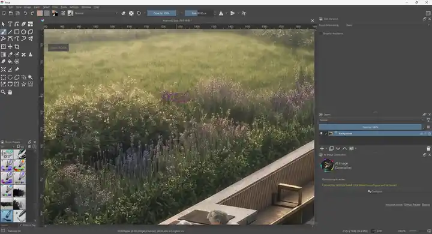
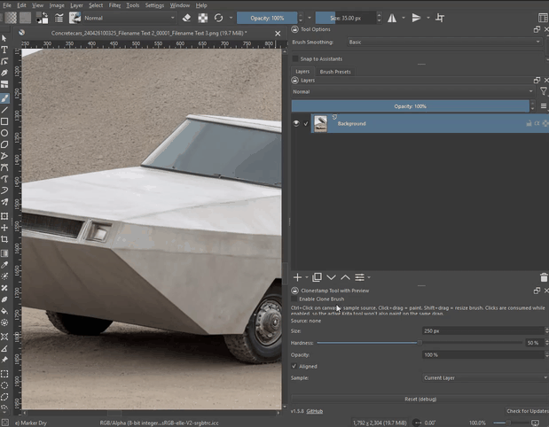

# Clonestamp Tool with Preview

A Photoshop-style Clone Stamp for [Krita](https://krita.org): Ctrl+click to
sample a source point, then drag to paint a soft-edged copy of it anywhere
else — with a live preview while you paint and a single undo step per
stroke. Krita has no native equivalent of this tool today; this project adds
one.

The main product is a **native C++ tool** that installs into the official
Krita 6.0.4 Windows build and appears as a real toolbox icon. A pure-Python
port for Krita 5.x is kept alongside it.

*Krita 6.0.4: brush tip list, square and textured tips, live cloning. [Full-quality video (MP4, 2.8 MB)](docs/demo-krita6.mp4)*

## Downloads

| Your Krita | Download | What you get |
| --- | --- | --- |
| **6.0.4 / 6.0.4.1, Windows x64** | **[Release v2.1.0](https://github.com/metamountain/krita-clonestamp/releases/tag/v2.1.0)** (`clonestamp_tool-krita-6.0.4-windows-x64.zip`, import as Python plugin) | Native C++ tool with a real toolbox icon — **recommended** |
| 5.x | [Release v1.0.2-krita5](https://github.com/metamountain/krita-clonestamp/releases/tag/v1.0.2-krita5) or [clonestamp.zip](https://github.com/metamountain/krita-clonestamp/raw/main/python-plugin/clonestamp.zip) | Python plugin (docker), see [below](#python-plugin-krita-5x) |
| other 6.x | not yet — each Krita version needs its own build; please [open an issue](https://github.com/metamountain/krita-clonestamp/issues) | |

The complete Krita 5 era of this project is preserved on the
[`krita-5`](https://github.com/metamountain/krita-clonestamp/tree/krita-5) branch.

## Native C++ tool (Krita 6.0.4)

A compiled `KisTool`/`KoToolFactoryBase` plugin that loads into the official
Krita 6.0.4 Windows x64 installation and registers a real entry in the
toolbox, next to **Smart Patch** (stamp icon, tooltip "Clonestamp Tool with
Preview").

### Installation (Krita 6.0.4, Windows x64)

**Recommended — like any Python plugin, no admin rights:**

1. Download **`clonestamp_tool-krita-6.0.4-windows-x64.zip`** from
   [Release v2.1.0](https://github.com/metamountain/krita-clonestamp/releases/tag/v2.1.0)
   (do not unzip it).
2. In Krita: **Tools › Scripts › Import Python Plugin from File...**, select
   the zip, answer **Yes** to enabling the plugin.
3. Restart Krita. The tool appears in the toolbox next to **Smart Patch**
   (stamp icon).

The zip contains a tiny loader plugin (`clonestamp_tool`) plus the native
tool library; the loader only loads that library from its own folder and
registers the tool — the same model as Acly's
[krita-ai-tools](https://github.com/Acly/krita-ai-tools). On a different
Krita version it refuses to load and tells you so. Uninstall: disable or
delete `clonestamp_tool` in **Settings › Configure Krita › Python Plugin
Manager**.

**Alternative — system-wide with `install.cmd`:** download
`clonestamp-krita-6.0.4-windows-x64.zip`, unzip, run `install.cmd` (checks
the Krita version, asks for admin rights, copies `kritatoolclonestamp.dll`
into `C:\Program Files\Krita (x64)\lib\kritaplugins\`). Uninstall:
delete that DLL. Both ways can coexist; the tool registers only once.

> **Krita 6.0.4.x on Windows x64 only.** A compiled Krita plugin is
> binary-locked to the Krita build it was compiled against (here: Qt 6.8,
> official 6.0.4 toolchain); every new Krita version needs a rebuild.

### Features

**Sampling**
- **Ctrl+click** — or **Alt+click**, the Photoshop habit (switchable) — sets the source point; the source is frozen as a
  copy-on-write snapshot, so strokes that cross their own source clone the
  *original* pixels, never freshly painted ones (Photoshop behavior).
- **Sample: Current Layer / All Layers** — toggle buttons at the top of the
  options; *All Layers* clones the merged image as you see it.
- **Aligned** on: the source moves with your strokes and keeps its offset
  across strokes; off: every stroke restarts from the sampled point.

**Brush tip**
- **Round** and **Square** generated tips with **Hardness** (soft to crisp
  edge).
- **Brush Tip**: any of Krita's built-in brush tips — including imported
  Photoshop **.abr** brushes — picked from Krita's tip list with thumbnails,
  tags and search.
- **Angle**, **Roundness** (flat/elliptical tips), **Spacing** (percent of
  the size; dabs are laid out along the path, so fast strokes leave no gaps).
- **Random angle per dab** for natural, painterly edges.
- **Presets**: *Hard*, *Soft*, *Square*, *Painterly* (textured tip, random
  angle, 60 % flow), *Airbrush* (soft, 8 % flow, builds up while held).

**Painting**
- **Live painting while you drag** — not only on release — with **one undo
  step per stroke**.
- **Opacity** caps a whole stroke (overlapping dabs never build past it);
  **Flow** is the coverage each dab adds and builds up within a stroke —
  Photoshop semantics.
- **Airbrush** with adjustable **rate**: keeps depositing while the button
  is held, even without moving.
- **Pen pressure** → **Size** and/or **Flow** (tablets).
- **Any bit depth**: painting goes through Krita's own `KisPainter`
  pipeline in the layer's own pixel format, nothing is reduced to 8-bit.
  Tested with RGBA 8-bit, 16-bit integer and 32-bit float; other color
  models use the same path.

**Preview and cursor**
- **Source preview** under the cursor, shaped like the brush tip, with
  adjustable **Preview** opacity (default 85 %, 0 % = off) and **Auto-hide**
  while painting.
- Destination and source outlines in the tip's real shape, drawn by
  Krita's GPU outline renderer without lag; red crosshair marks the source.
- Dashed inner outline shows the fully hard zone.
- **Shift+drag** on the canvas: horizontal = size, vertical = hardness.

**Workflow**
- Compact options panel, no scrolling: sample source first, sliders in two
  columns.
- Clear on-canvas messages instead of silent failure ("Ctrl+click to set a
  source point first", locked layer, no paint layer selected, …).

**Performance**
- 1-byte-per-pixel stroke buffer, compositing at most ~60 times per second
  over the combined area, one mask per stroke, cached tip rotations,
  pre-converted preview blocks — smooth on older machines and large brushes
  (up to 2000 px).

### Usage

| Action | Gesture |
| --- | --- |
| Set the source point | **Ctrl+click** or **Alt+click** on the canvas |
| Paint (live while dragging) | **Click and drag** |
| Resize brush / adjust hardness | **Shift+drag** (horizontal / vertical) |
| Switch sample source | **Current Layer / All Layers** buttons (Tool Options) |
| Quick brush setup | Preset buttons **Hard · Soft · Square · Painterly · Airbrush** |

> **Custom key for sampling:** the tool follows Krita's *Sample foreground color from
> merged image* binding, so you can move Ctrl+click to any key in *Settings › Configure
> Krita › Canvas Input Settings › Alternate Invocation* (this also changes color
> sampling for the other tools).

### Options reference (Tool Options docker)

| Option | Range | Meaning |
| --- | --- | --- |
| Current Layer / All Layers | toggle | What Ctrl+click reads from; applies at the next Ctrl+click |
| Aligned | on/off | Keep the source offset across strokes |
| Tip | Round / Square / Brush Tip | Generated tip or any Krita brush tip |
| Size | 1–2000 px | Longer side of the tip |
| Hard | 0–100 % | Edge hardness (Round/Square) |
| Opacity | 0–100 % | Maximum coverage of one stroke |
| Flow | 1–100 % | Coverage added per dab |
| Angle | 0–359° | Tip rotation |
| Round | 1–100 % | Roundness: squashes the tip |
| Spacing | 1–200 % | Dab distance in percent of the size |
| Rate | 1–100 /s | Airbrush dabs per second while holding still |
| Preview | 0–100 % | Opacity of the source preview under the cursor |
| Auto-hide | on/off | Hide the preview during a stroke |
| Rnd angle | on/off | Random rotation per dab |
| Airbrush | on/off | Build up while the button is held |
| Pressure: Size / Flow | on/off | Pen pressure controls size and/or flow |
| Alt-click | on/off | Alt+click also sets the source (Ctrl+click always works) |

## Python plugin (Krita 5.x)

A pure-Python implementation on Krita's `libkis` scripting API. It **works
on Krita 5.x only** — it uses PyQt5, which Krita 6 does not provide ("not
compatible with PyQt5"). An untested PyQt6 port exists on the `qt6-port`
branch.

1. Download **[clonestamp.zip](https://github.com/metamountain/krita-clonestamp/raw/main/python-plugin/clonestamp.zip)**
   (the ready-to-import plugin package, rebuilt from source on every
   change — not the whole repository).
2. In Krita: **Tools › Scripts › Import Python Plugin from File...** and
   select the downloaded zip.
3. Restart Krita, then enable the docker under **Settings › Dockers ›
   Clonestamp Tool with Preview**.

No build step. The installed version is shown at the bottom of the docker;
*Check for Updates* keeps it current from then on (a restart is required
after an update, since Krita loads Python plugins only at startup).

### Technical notes and known limitations (Python)

- **Strokes commit at mouse release.** A drag accumulates dabs into an
  in-memory alpha mask and writes the composited result to the layer once —
  the only way to get a single undo step through the scripting API, which
  exposes no undo grouping. The on-canvas preview during the drag is a close
  approximation; the committed pixels are always computed the exact way. On
  large canvases this buffer is sizeable (capped at ~800 MB; larger canvases
  are refused with a message).
- **Mouse input is polled.** Continuous mouse-move is not exposed to
  Krita's scripting API, so drags are tracked by polling the cursor at
  30 ms intervals via a global event filter (a technique adapted from the
  Krita Artists forum).
- **The native brush outline is swapped out.** While the brush is enabled,
  Krita's own brush-outline cursor is toggled off and the plugin draws its
  own ring cursor instead; if Krita exits abnormally mid-session, that
  toggle can be left inverted (toggle it back via the `toggle_brush_outline`
  shortcut or by enabling/disabling the plugin once).
- **Diagnostics are off by default** (they cost real per-stroke I/O). To
  enable: create an empty file named `clonestamp_debug.enable` in your
  `%TEMP%` folder and restart Krita; logs go to `clonestamp_debug.txt`
  next to it. Delete the file and restart to disable.

## Repository layout

| Path | Contents |
| --- | --- |
| `Tool-plugin/` | The native C++ `KisTool` implementation — the flagship product. |
| `release/` | Prebuilt per-Krita-version release folders (currently `krita-6.0.4-windows-x64/` with `install.cmd` + the DLL). |
| `Tool-plugin/pykrita-loader/` | The Python loader plugin (`clonestamp_tool`) packaged with the DLL into the importable zip. |
| `Tool-plugin/windows/` | Windows build/deploy scripts (`build-krita.bat`, `deploy-tool.cmd`). |
| `python-plugin/` | The installable Krita 5.x Python plugin and the packaged `clonestamp.zip`. |
| `tools/krita_mcp/` | Automated test harness — an MCP bridge (`kritamcp` plugin + `krita_mcp.py` server + `kcall.py` CLI) and the test scripts. |
| `docs/` | Development history, build/toolchain notes, per-change test documentation, and `krita-pitfalls.md` (verified pitfalls with evidence). |

## Why two implementations?

Krita's Python scripting API cannot register a new entry in the native
toolbox — that requires a compiled `KisTool`/`KoToolFactoryBase` built as
part of Krita itself. The Python plugin works around this with a docker and
an application-level mouse event filter. The C++ tool is the real toolbox
icon, and — because a compiled Krita plugin is ABI-locked to the exact Krita
build it was compiled against — it is now **directly installable for the one
matching version** (Krita 6.0.4.x on Windows x64) via the `release/` folder
and `install.cmd`, rather than requiring a build. A new Krita version means
a rebuilt DLL. The C++ tool is ahead of the Python one: it paints live per
frame, supports all bit depths/color spaces, brush tips, presets, and
pressure; the Python plugin remains the Krita 5.x path.

## Project status and contributing

This project was built by **metamountain** — not a professional
programmer — in AI-assisted pair programming with Claude Code. The C++ tool
is now backed by an automated test harness (`tools/krita_mcp/`) that drives
the real mouse against a running Krita; the Python plugin is validated by
hands-on testing. It works, and it is honest about what it is.

**If you are an experienced Krita, Qt, or KDE developer**, your review,
maintenance, or help shepherding the C++ tool through Krita's contribution
process could turn this from a personal prototype into something upstream.
The `docs/` directory preserves the full development trail — including
dead ends and their resolutions — precisely to make that handover
feasible.

Bug reports are welcome and genuinely useful: please
[open an issue](https://github.com/metamountain/krita-clonestamp/issues)
describing what you did and what happened.

## Credits

- **[Krita](https://krita.org)** and the **KDE community** — the
  application and APIs this project builds on.
- **Krita Artists forum** — origin of the global-event-filter technique
  for canvas mouse capture from Python.
- **[Acly/krita-ai-tools](https://github.com/Acly/krita-ai-tools)** —
  studied as the closest precedent for distributing a Krita plugin with a
  compiled component; its per-Krita-version release packaging informed this
  project's `release/` distribution model.
- **[Phosphor Icons](https://phosphoricons.com)** — the toolbox stamp icon
  (`stamp-fill`, MIT license, Copyright (c) 2020 Phosphor Icons).
- **`fonkle/clonestamp_tool`** (2022 branch on `invent.kde.org`) —
  examined as prior art for native toolbox registration.
- Built with AI pair-programming assistance from **Claude Code**
  (Anthropic).

## License

- Repository overall and `Tool-plugin/`: **GPL-2.0-or-later** (see
  `LICENSE`) — the C++ tool derives from and links against Krita's GPL
  codebase.
- `python-plugin/`: **CC0-1.0** (public-domain dedication, per the SPDX
  headers in its files) — deliberately unencumbered.
- Toolbox icon: **MIT** (Phosphor Icons "stamp-fill", Copyright (c) 2020
  Phosphor Icons).
